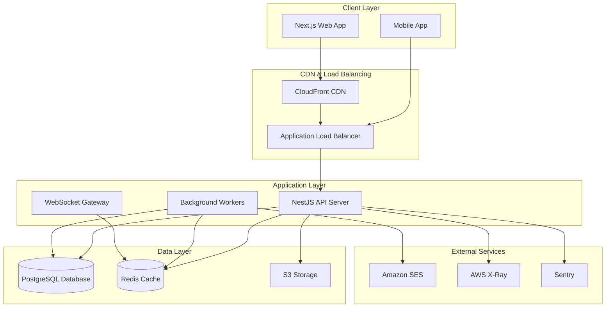

# System Overview

## Architecture Overview

Kanvaro is a performance-first, single-tenant, open source project management system built for modern development teams. The system is designed to be self-hosted with optional AWS deployment automation.

## High-Level Architecture

## Core Components

### Frontend (Next.js)
- **Framework**: Next.js 14 with App Router
- **Language**: TypeScript
- **Styling**: Tailwind CSS
- **UI Components**: Radix UI
- **State Management**: Zustand + TanStack Query
- **Drag & Drop**: dnd-kit
- **Rich Text**: TipTap editor
- **Charts**: Recharts/ECharts
- **Data Grid**: AG Grid

### Backend (NestJS)
- **Framework**: NestJS with Fastify
- **Language**: TypeScript
- **ORM**: Prisma
- **Database**: PostgreSQL 15+
- **Cache**: Redis (ElastiCache)
- **Queue**: BullMQ
- **WebSockets**: Socket.IO with Redis adapter
- **Authentication**: Session-based with Argon2id
- **Search**: PostgreSQL FTS + pg_trgm

### Infrastructure (AWS)
- **Compute**: ECS Fargate
- **Database**: RDS PostgreSQL (Multi-AZ)
- **Cache**: ElastiCache Redis (Multi-AZ)
- **Storage**: S3 (attachments, static assets)
- **CDN**: CloudFront
- **Load Balancer**: ALB
- **DNS**: Route53
- **SSL**: ACM
- **Email**: SES
- **Security**: WAF
- **Monitoring**: CloudWatch, X-Ray, Sentry

## Key Design Principles

### 1. Performance First
- Server-side rendering (SSR) with Next.js
- Optimized bundle sizes (<100KB gzipped)
- Virtualized lists for large datasets
- Database query optimization
- Redis caching strategy
- CDN distribution

### 2. Single-Tenant Architecture
- One organization per deployment
- Isolated data and resources
- Customizable branding and settings
- Self-hosted or AWS deployment options

### 3. Security by Design
- Argon2id password hashing
- Session-based authentication
- CSRF protection
- Rate limiting
- Input validation
- Audit logging
- Encryption at rest and in transit

### 4. Scalability
- Horizontal scaling with ECS Fargate
- Database connection pooling
- Redis pub/sub for real-time features
- Background job processing
- Auto-scaling capabilities

### 5. Developer Experience
- TypeScript throughout
- Comprehensive documentation
- Local development setup
- CI/CD pipeline
- Testing strategy
- Code quality tools

## Data Flow

### User Authentication
1. User submits credentials
2. API validates with Argon2id
3. Session created and stored in Redis
4. HttpOnly cookies set
5. User redirected to dashboard

### Real-time Updates
1. User action triggers API call
2. API updates database
3. Outbox pattern triggers events
4. Redis pub/sub distributes to all instances
5. WebSocket gateway sends to connected clients
6. UI updates optimistically

### File Uploads
1. Client requests presigned URL
2. File uploaded directly to S3
3. Database record created
4. WebSocket notification sent
5. UI updates with new attachment

## Deployment Options

### Self-Hosted
- Docker Compose setup
- Local PostgreSQL and Redis
- Manual SSL configuration
- Basic monitoring

### AWS Production
- Terraform infrastructure
- ECS Fargate services
- RDS Multi-AZ database
- ElastiCache Redis cluster
- CloudFront CDN
- Automated backups
- Comprehensive monitoring

## Performance Targets

- **Web Vitals**: LCP < 2.5s, TTI < 2s, TTFB < 300ms
- **API Response**: P95 < 200ms for reads, < 350ms for writes
- **Database**: < 1s for complex reports on 50k tasks
- **WebSocket**: Support 1k+ concurrent connections
- **Bundle Size**: < 100KB gzipped for main routes

## Security Considerations

- **Authentication**: Multi-factor authentication support
- **Authorization**: Role-based access control
- **Data Protection**: Encryption at rest and in transit
- **Network Security**: VPC isolation, security groups
- **Application Security**: Input validation, rate limiting
- **Monitoring**: Security event logging and alerting

## Monitoring and Observability

- **Application Metrics**: Custom business metrics
- **Infrastructure Metrics**: AWS CloudWatch
- **Distributed Tracing**: AWS X-Ray
- **Error Tracking**: Sentry
- **Logging**: Structured logging with correlation IDs
- **Alerting**: CloudWatch alarms and notifications

## Next Steps

1. Review [Backend Architecture](./backend-architecture.md) for API details
2. Check [Frontend Architecture](./frontend-architecture.md) for UI components
3. Understand [Data Model](./data-model.md) for database design
4. Follow [Local Development Setup](../developer/local-dev-setup.md) to get started
